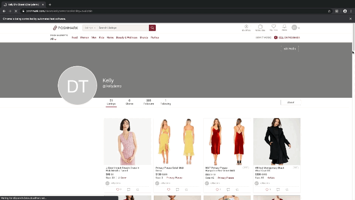

# PoshmarkNursery
PoshmarkNursery is a bot that shares available items from one's own Poshmark closet to his/her followers on a schedule. It can also be configured to share back items from people who shared your items or share items from a given list of closets. <a href="https://www.poshmark.com">Poshmark</a> is an online reselling platform, and sharing one's own items helps to promote sales.

# Motivation
I started reselling some of my clothes on Poshmark in the summer of 2019 and quickly learned that regularly sharing my own items is essential for sales. The act of sharing is tedious, so I wrote this script to automate it.

Over time, I experimented with sharing back and sharing other users' closets. I found that these actions did not meaningfully increase likes or sales. In one case, I was even blocked by a seller for sharing her closet too frequently. As a result, I have not used those features in several years. **They are included for completeness but are not actively maintained and may not work with the current Poshmark UI.** For best results, use the script to share your own closet only.

# Prerequisites
* Python 3.7.3+
* Selenium 3.141.0+
* Firefox browser (latest version recommended)
* <a href="https://github.com/mozilla/geckodriver/releases">geckodriver</a> (must be in your PATH)

# Setup
Clone the source locally:
```
git clone https://github.com/xzhou13/PoshmarkNursery
```

Modify the "config.py" file to contain your Poshmark login and password within the "". 
```
username = r"username"
password = r"password"
```

# To Run In Default Mode
Run in terminal with the following options:

Default mode (self-share once every 30 minutes while checking for captcha, preserving order via "order.txt", not sharing/following back, not sharing closets from file):
```
python posh_nursery.py
```

# Two‑Factor Authentication (2FA)

Poshmark now requires 2FA for most accounts. The script automatically detects the verification prompt after login, asks for the code on the command line, and submits it for you. Simply enter the code sent to your phone and hit "Enter" via command line when prompted.

Example output:
```
Logging in Poshmark as username...
2FA verification required. Please enter the code sent to your phone.
Enter verification code: 123456
2FA code submitted.
Logged into poshmark
```

# Advanced options
Four optional command line arguments in this order:
```
python posh_nursery.py {integerNumberOfSeconds} {Y|N} {Y|N} {Y|N}
```

1. **`{integerNumberOfSeconds}`** – Number of seconds to wait between sharing cycles. Default `1800` (30 minutes).

2. **`{Y|N}`** – Check for captcha while sharing. Default `Y`.  
   When `N`, the script will not pause for captcha solving; it may get stuck but will continue trying. Useful for unattended runs.

3. **`{Y|N}`** – Share closets listed in `closetsToShare.txt`. Default `N`.  
   ⚠️ **Note:** This feature is **not actively maintained** and may not work with the latest Poshmark UI. Use at your own risk. When `Y`, the program shares only those closets (once) and then exits.

4. **`{Y|N}`** – Preserve closet order using `order.txt`. Default `Y`.  
   Items are shared in the order listed in `order.txt`. New items are added to the top; sold/removed items are deleted from the file.

<p align="center">
  
</p>

Debugging Tip: Consider sharing with "headless" mode turned off. This will show the selenium driven Firefox window. To turn off headless mode, comment out this line in the "posh_nursery.py" file:
```
self.firefoxoptions.add_argument("-headless")
```

# Maintenance
* Captcha: This will get caught by captcha. In the default mode, when this happens, the script detects it, enters into the debugger mode, pauses sharing, and waits for the user to manually solve the captcha. After solving the captcha, type 'c' or 'continue' in the debugger to continue the sharing. I recommend logging into your Poshmark account on a web browser (not the selenium driven chromedriver window), and then share an item there. This will reduce the number of captchas you'll have to solve. If you attempt to solve the captcha in the selenium driven window, you'll be prompted to solve more captcha. If it gets caught in the log in screen, re-enter the password, check "I'm not a robot", solve the capcha in the chromedriver window. After you log in, type 'c' or 'continue' in the debugger to continue. In the case that it gets caught in the log in window, consider running the script less frequently. If you're going to be away from your computer, you can run it with checking for captcha turned off (1st optional parameter, read more about optional parameters [here](#Advanced-options)). 
* If you continuously see the message "Timed out while waiting for share modal to disappear..clicking second share again" on the stdout, that might mean you've hit a sharing threshold Poshmark set, which could prohibit you from sharing for a number of hours. Consider sharing less frequently in this case. I've only hit this limit when I shared with this script non-stop for a few hours. 
* geckodriver: Update geckodriver when Firefox updates to a new major version.
* UI updates: Poshmark occasionally changes its HTML/CSS. If the script stops finding share buttons or item names, you may need to update the XPaths in posh_nursery.py (look for firstShareXPath, itemNameXPath, etc.).
